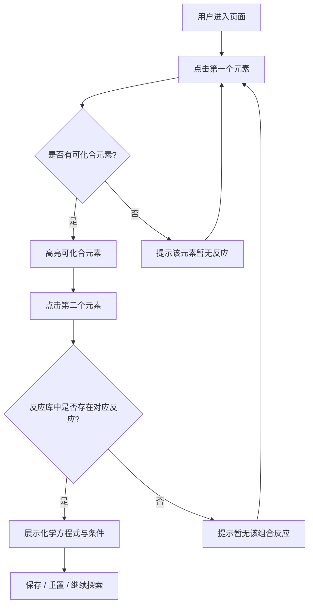

## 1. 产品概述
化学方程式互动工具是一款面向课堂演示的单页 Web 应用。教师或学生点击元素周期表中的元素后，系统高亮显示可与其发生化合反应的其他元素，选择第二个元素即可生成常见化合物并展示配平后的化学方程式。工具支持搜索定位、反应条件提示、方程式收藏与移动端触摸操作，旨在让化学课堂的"元素相遇"过程直观、可交互、易复用。

目标用户：中学及高校化学教师、学生、自学化学爱好者。

## 2. 核心功能

### 2.1 功能模块
1. **元素周期表模块**：彩色区块展示常见元素，支持点击、搜索高亮、触摸选择。
2. **反应交互模块**：选中首个元素后高亮可化合元素，选择第二个元素生成化合物与方程式。
3. **方程式展示模块**：高亮文字展示反应物、生成物与反应条件（加热、催化剂、点燃等）。
4. **搜索与定位模块**：输入元素符号或名称快速定位并选中元素。
5. **收藏与本地保存模块**：一键保存常用方程式到浏览器 localStorage，支持查看与删除。
6. **课堂演示辅助模块**：一键重置、全屏友好布局、大号高亮文字。

### 2.2 页面详情
| 页面名称 | 模块名称 | 功能描述 |
|---------|---------|---------|
| 主页面 | 元素周期表 | 网格化展示元素，按金属/非金属/稀有气体等类别着色 |
| 主页面 | 反应舞台 | 展示已选元素、生成的化合物名称与化学方程式 |
| 主页面 | 搜索栏 | 输入符号/名称实时过滤并定位元素 |
| 主页面 | 收藏夹 | 列出已保存的方程式，支持快速载入与删除 |
| 主页面 | 控制区 | 重置按钮、反应条件提示标签 |

## 3. 核心流程
用户进入页面后，看到的操作流程如下：

1. 在元素周期表中点击第一个元素（如 H）。
2. 系统高亮所有能与氢直接化合的元素（如 O、Cl、N、C 等）。
3. 用户点击高亮元素中的第二个（如 O）。
4. 系统查找内置反应库，匹配 H + O 生成 H₂O 的反应。
5. 在反应舞台展示完整方程式，并附带反应条件（如"点燃"）。
6. 用户可选择保存方程式到收藏夹，或点击重置重新开始。

## 4. 用户界面设计

### 4.1 设计风格
- **主题**："实验室夜光" —— 深色背景营造黑板/暗室氛围，元素卡片采用高饱和度的类别色，选中态带有霓虹光晕。
- **主色**：背景 `#0B0F19`，文字 `#F8FAFC`，辅助文字 `#94A3B8`。
- **类别色**：碱金属 `#FF4D6D`、碱土金属 `#FFB703`、过渡金属 `#3A86FF`、非金属 `#06D6A0`、卤素 `#9D4EDD`、稀有气体 `#00B4D8`、类金属 `#FB5607`。
- **选中/高亮色**：发光边框 `#38BDF8` 与 `#F472B6`。
- **字体**：标题使用 JetBrains Mono（等宽科技感），正文使用 Noto Sans SC。
- **按钮**：圆角 12px，悬停时轻微上浮并增强阴影；重置按钮使用醒目的橙色边框。
- **布局**：桌面端左侧周期表、右侧反应舞台；移动端上下堆叠，周期表可横向滚动。

### 4.2 页面设计概述
| 页面名称 | 模块名称 | UI 元素 |
|---------|---------|---------|
| 主页面 | 顶部栏 | Logo、搜索框、重置按钮 |
| 主页面 | 元素周期表区 | 彩色网格卡片、悬停/选中/可化合态 |
| 主页面 | 反应舞台区 | 选中元素展示、化合物卡片、方程式高亮文本、反应条件标签 |
| 主页面 | 收藏夹抽屉 | 已保存方程式列表、删除按钮 |

### 4.3 响应式与触摸优化
- 桌面优先：左侧 60% 周期表 + 右侧 40% 舞台。
- 平板/手机：上下布局，周期表容器横向滚动并启用 `touch-action: pan-x`。
- 元素卡片最小触控尺寸 44px × 44px，触摸时放大反馈。
- 搜索框在移动端置于顶部，支持软键盘回车定位。
- 收藏夹在移动端作为底部抽屉滑出。

### 4.4 动画与微交互
- 页面加载：标题与周期表行 stagger 淡入。
- 元素 hover：卡片轻微放大 1.05 并产生光晕。
- 可化合元素高亮：脉冲边框动画，吸引注意力。
- 方程式生成：数字与下标逐个弹入的 stagger 效果。
- 重置：舞台区域淡出后重新进入。
