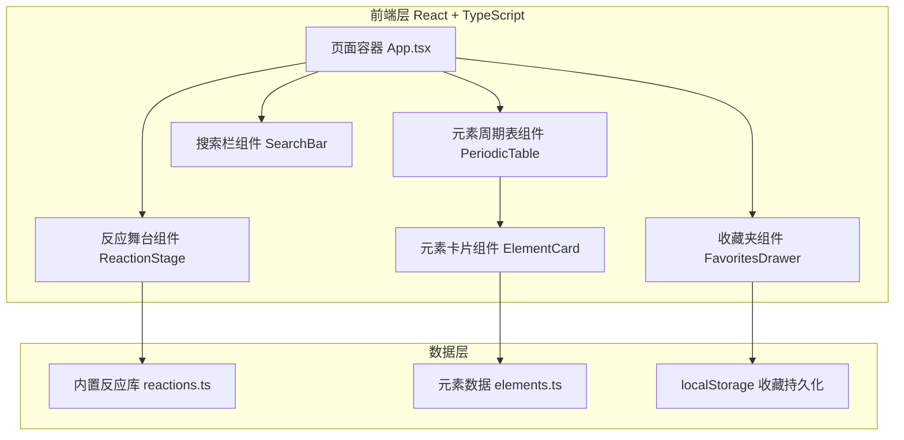

## 1. 架构设计



## 2. 技术选型

- **前端框架**：React 18 + TypeScript
- **构建工具**：Vite
- **样式方案**：Tailwind CSS 3
- **状态管理**：Zustand（管理当前选中元素、可化合元素、当前反应、收藏列表）
- **图标库**：lucide-react
- **本地存储**：浏览器 localStorage（保存用户收藏的方程式）
- **字体**：Google Fonts 引入 JetBrains Mono 与 Noto Sans SC

## 3. 路由定义

| 路由 | 用途 |
|-----|------|
| / | 单页应用主页面，包含所有功能模块 |

## 4. API 定义

本项目为纯前端应用，不涉及后端 API。数据交互通过本地 TypeScript 常量与 localStorage 完成。

## 5. 数据模型

### 5.1 元素定义

```typescript
interface ChemicalElement {
  symbol: string;        // 元素符号，如 "H"
  name: string;          // 中文名称，如 "氢"
  atomicNumber: number;  // 原子序数
  group: ElementGroup;   // 类别：metal | nonmetal | halogen | noble | metalloid | alkali | alkaline
  row: number;           // 周期表行号（用于布局）
  col: number;           // 周期表列号（用于布局）
}
```

### 5.2 反应定义

```typescript
interface ChemicalReaction {
  id: string;                         // 唯一标识
  reactants: string[];                // 反应物元素符号列表
  product: string;                    // 生成物化学式
  productName: string;                // 生成物中文名称
  equation: string;                   // 配平后的方程式字符串
  condition: string;                  // 反应条件，如 "点燃"
  description?: string;               // 简短说明
}
```

### 5.3 收藏定义

```typescript
interface SavedReaction {
  id: string;
  equation: string;
  productName: string;
  savedAt: number;
}
```

## 6. 关键交互逻辑

1. **首次点击元素**：设为 `firstElement`，根据反应库筛选包含该元素的反应，提取另一反应物集合作为 `reactiveElements`。
2. **第二次点击元素**：若该元素在 `reactiveElements` 中，查找对应反应并设置 `currentReaction`；否则给出提示。
3. **重置**：清空 `firstElement`、`reactiveElements`、`currentReaction`。
4. **搜索定位**：根据输入匹配 symbol 或 name，自动滚动到对应元素并模拟点击；若只有一个匹配则直接选为第一个元素。
5. **收藏保存**：将当前反应的 id、方程式、生成物名称与时间戳写入 localStorage。
